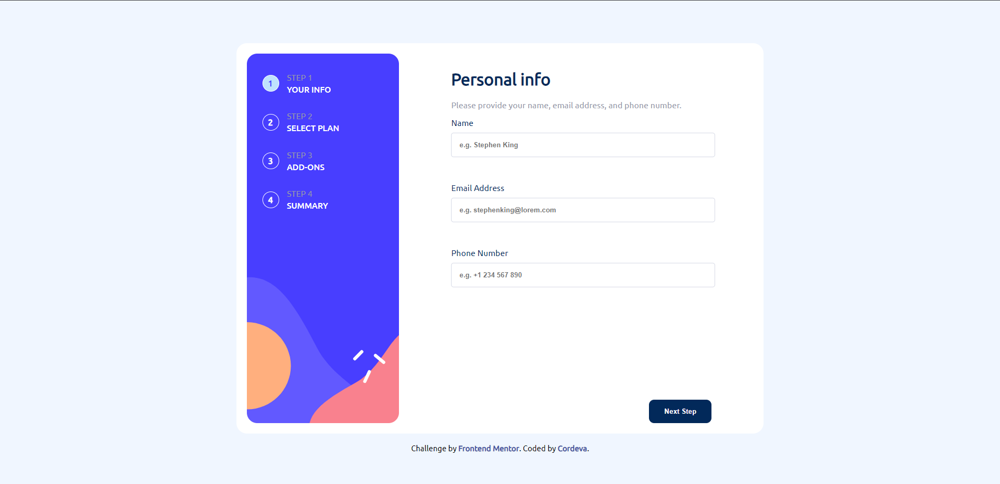
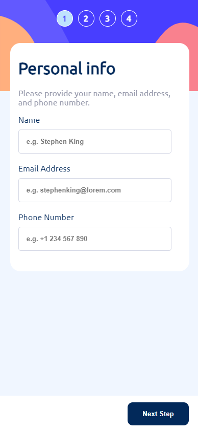

# Frontend Mentor - Multi-step form solution

This is a solution to the [Multi-step form challenge on Frontend Mentor](https://www.frontendmentor.io/challenges/multistep-form-YVAnSdqQBJ).

## Table of contents

- [Overview](#overview)
- [The challenge](#the-challenge)
- [Demo](#links)
- [Screenshot](#screenshot)
- [Built with](#built-with)
- [What I learned](#what-i-learned)

## Overview

The Multi-Step Form project is a web application designed for user-friendly data collection. It offers a structured form interface with step-by-step progression, intuitive updates, and real-time feedback.
It ensures a responsive design and form validation for an enhanced user experience.

## The challenge

Users should be able to:

- Complete each step of the sequence
- Go back to a previous step to update their selections
- See a summary of their selections on the final step and confirm their order
- View the optimal layout for the interface depending on their device's screen size
- See hover and focus states for all interactive elements on the page
- Receive form validation message if a field has been missed

## Demo

- Live Site URL: [Click Here!](https://xcordeva.github.io/multi-step-form-FrontendmentorChallenges)

## Screenshot 

### Desktop View

### Mobile View

## Built with

- Semantic HTML5 markup
- CSS custom properties
- Flexbox
- JavaScript
- Responsive design using CSS Media Queries

## What I learned

In the process of building this project, I faced several challenges and learned valuable lessons, including:

- Implementing form validation for required fields.
- Managing the state of the multi-step form.
- Creating a responsive layout for various screen sizes.
- Enhancing the user experience with CSS transitions and hover/focus effects.

